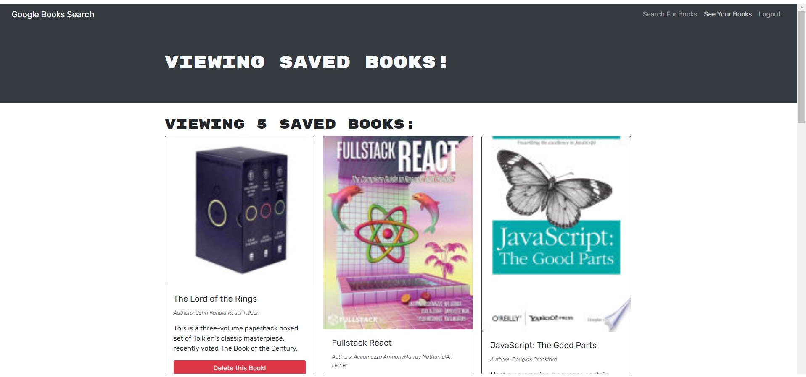

# Search a Book

## DESCRIPTION

> To understand mutations from GraphQL
> and incorporation Apollo Server.
> By utilizing a new skill that is not REST API.

## INSTALLATION

> Visit Heroku site, or cloen the repo, npm install, npm run develop (thanks concurrent) and you're good to go!

## USAGE

To search for books you're interested in!

## LANGUAGES & TECHNOLOGIES

> JavaScript,CSS,ES6,Bootstrap,Node and REACT, Mongoose, MongoDB, Apollo, GraphQL

## AUTHOR(S)

>

- [Jacob Ambrose](https://www.github.com/jambrose0)
  >

## LICENSE

## PREVIEW

>  >  > 
